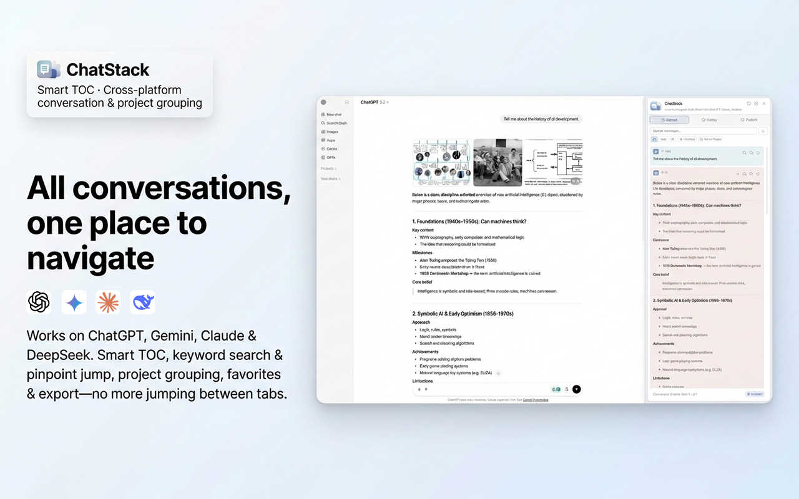
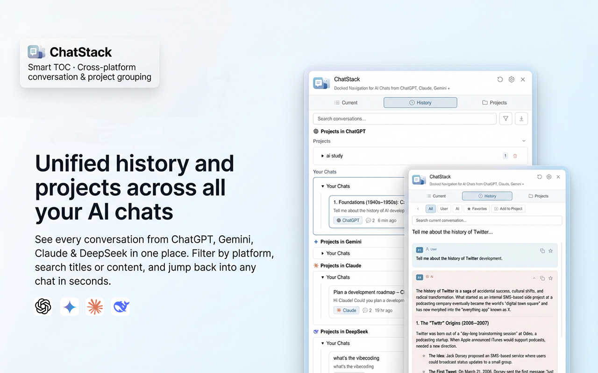
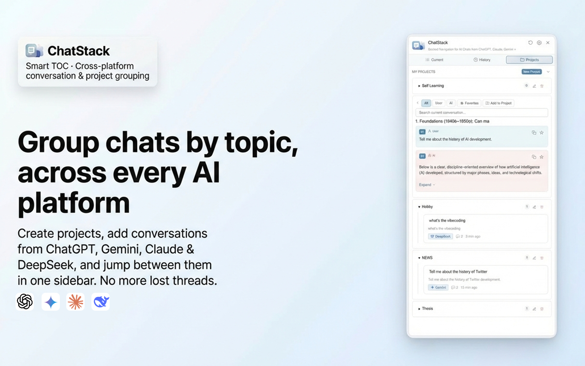

# ChatStack

ChatStack 是一个本地优先的 Chromium 浏览器扩展，为 ChatGPT、Gemini、Claude 和 DeepSeek 增加统一侧边栏：当前对话目录、搜索跳转、历史整理、项目分组、收藏与导出。

> 当前状态：`v1.2.0` 公开候选版，支持从 GitHub 手动安装；尚未发布到 Chrome Web Store。

## 产品界面

ChatStack 停靠在 AI 对话页面右侧，不打断原有使用路径。以下界面均使用演示数据。

<p align="center">
  
</p>

| 跨平台历史 | 项目分组 |
| --- | --- |
| 在一个侧边栏中浏览 ChatGPT、Gemini、Claude 与 DeepSeek 的本地历史。 | 按主题整理对话，并把当前消息加入自定义项目。 |
|  |  |

## 功能

- 当前对话目录：按消息生成目录，点击即可定位并高亮。
- 搜索与筛选：在当前对话及本地历史中检索，支持按角色、日期和平台筛选。
- 项目分组：保留平台自动分组，也可创建本地自定义项目。
- 收藏与导出：收藏消息，并将选中内容导出为 JSON、Markdown、TXT 或 ZIP。
- 多平台：使用独立适配器支持 ChatGPT、Gemini、Claude、DeepSeek。
- 本地优先：没有后端、账户系统、遥测或分析；扩展数据保存在 `chrome.storage.local`。

## 安装

### 从 GitHub Release 安装

1. 在仓库的 Releases 页面下载 `chatstack-extension-v1.2.0.zip`。
2. 解压 ZIP。
3. 打开 `chrome://extensions/` 或 `edge://extensions/`。
4. 开启“开发者模式”，选择“加载已解压的扩展程序”。
5. 选择解压后的 ChatStack 文件夹。

### 从源码安装

Clone 或下载本仓库后，按照上面的第 3–5 步加载仓库根目录。运行扩展不需要安装 npm 依赖；npm 依赖仅用于开发检查和测试。

## 支持站点

| 平台 | 地址 |
| --- | --- |
| ChatGPT | [chatgpt.com](https://chatgpt.com) / [chat.openai.com](https://chat.openai.com) |
| Gemini | [gemini.google.com](https://gemini.google.com) |
| Claude | [claude.ai](https://claude.ai) |
| DeepSeek | [chat.deepseek.com](https://chat.deepseek.com) |

打开支持平台的对话页面后，点击浏览器工具栏中的 ChatStack 图标即可显示或隐藏侧边栏。

## 隐私与权限

ChatStack 只申请：

- `storage`：在浏览器本地保存设置、项目和选择保存的对话数据。
- 四个平台对应的主机权限：在对话页面读取 DOM 并渲染侧边栏。

扩展不包含远程服务、遥测、广告或分析 SDK，也不会把对话内容发送给开发者或第三方。完整说明见 [PRIVACY.md](PRIVACY.md)，安全问题报告方式见 [SECURITY.md](SECURITY.md)。

## 本地开发

需要 Node.js 20 或更高版本：

```bash
npm ci
npm run check
```

`npm run check` 会执行 ESLint、Vitest 和 Manifest 资源完整性检查。当前自动化测试覆盖存储、项目并发映射、DOM 转 Markdown、平台生命周期以及侧边栏拆分模块的关键连接。

## 项目结构

```text
├── manifest.json
├── background.js
├── _locales/
├── core/                 # 本地存储、目录、项目与国际化
├── content/              # 平台适配器及侧边栏模块
├── icons/
├── lib/                  # 浏览器运行时依赖（JSZip）
├── scripts/              # 发布前校验
└── tests/
```

## 已知边界

- 目标平台调整页面 DOM 后，对应适配器可能需要更新。
- 当前只面向 Chrome、Edge 等 Chromium 浏览器。
- 仓库公开与手动安装不代表已经通过 Chrome Web Store 审核。

ChatStack 是独立开源项目，与 OpenAI、Google、Anthropic、DeepSeek 无隶属或背书关系。

## License

[MIT](LICENSE) © 2026 heyfanlab
